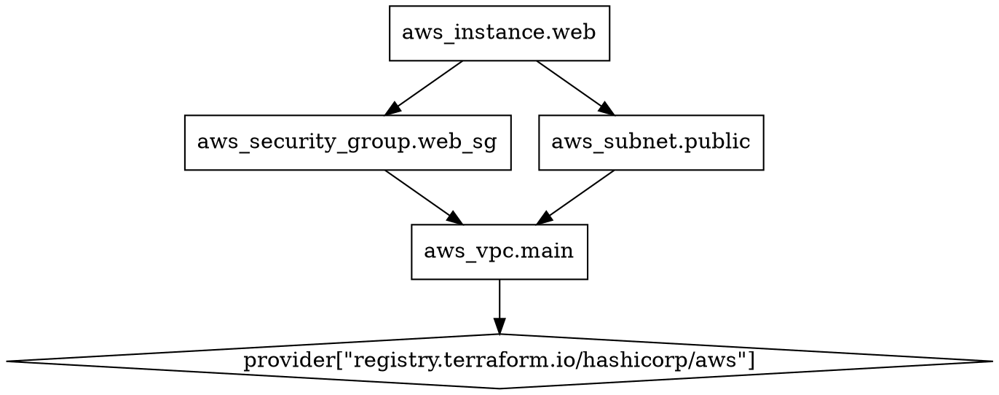

# Part 031: Terraform Graph & Dependencies
# Terraform Graph และ Dependencies

## Steps 301-310: ทำความเข้าใจ Dependency Graph ใน Terraform

---

## Step 301: terraform graph Command คืออะไร?

### ความหมายและการใช้งาน

`terraform graph` เป็นคำสั่งที่สร้าง **dependency graph** ของ Terraform configuration ในรูปแบบ **DOT format** (ใช้โดย GraphViz) ซึ่งช่วยให้เราเห็นภาพว่า resources ต่างๆ มีความสัมพันธ์กันอย่างไร

### ทำไมต้องใช้ terraform graph?

- เข้าใจ **ลำดับการสร้าง** resources
- ค้นหา **circular dependencies**
- วางแผน **parallel execution**
- **Debug** ปัญหาที่เกิดจาก dependencies
- **Document** infrastructure architecture

### การใช้งานพื้นฐาน

```bash
# สร้าง graph ของ configuration ปัจจุบัน
terraform graph

# สร้าง graph แล้ว pipe ไปยัง GraphViz
terraform graph | dot -Tpng -o graph.png

# สร้าง graph ในรูปแบบ SVG
terraform graph | dot -Tsvg -o graph.svg

# สร้าง graph แบบ plan (ดูว่าจะเกิดอะไรขึ้น)
terraform graph -type=plan

# สร้าง graph แบบ apply
terraform graph -type=apply

# สร้าง graph แบบ destroy
terraform graph -type=destroy
```

### ตัวเลือก (Flags) ของ terraform graph

```bash
terraform graph [options]

Options:
  -draw-cycles    ไฮไลท์ circular dependencies ด้วยสี
  -type=TYPE      ประเภทของ graph:
                    plan        (default)
                    plan-destroy
                    apply
                    validate
                    input
                    refresh
  -module-depth=N ความลึกของ module ที่จะแสดง
```

---

## Step 302: GraphViz DOT Format

### รูปแบบของ DOT Format

เมื่อรัน `terraform graph` จะได้ผลลัพธ์ในรูปแบบ DOT language ดังนี้:



### วิธีแปลง DOT เป็นภาพ

```bash
# ติดตั้ง GraphViz
# Ubuntu/Debian
sudo apt-get install graphviz

# macOS
brew install graphviz

# CentOS/RHEL
sudo yum install graphviz

# แปลงเป็นรูปแบบต่างๆ
terraform graph | dot -Tpng -o infrastructure.png
terraform graph | dot -Tsvg -o infrastructure.svg
terraform graph | dot -Tpdf -o infrastructure.pdf
terraform graph | dot -Tjpg -o infrastructure.jpg

# เปิดดู (macOS)
terraform graph | dot -Tpng | open -a Preview -f

# เปิดดู (Linux)
terraform graph | dot -Tpng > /tmp/graph.png && xdg-open /tmp/graph.png
```

---

## Step 303: การอ่านและตีความ Graph Output

### ตัวอย่าง Configuration

```hcl
# main.tf - ตัวอย่าง Infrastructure ที่มี Dependencies

terraform {
  required_providers {
    aws = {
      source  = "hashicorp/aws"
      version = "~> 5.0"
    }
  }
}

provider "aws" {
  region = "ap-southeast-1"
}

# VPC - ไม่มี dependency กับ resource อื่น
resource "aws_vpc" "main" {
  cidr_block           = "10.0.0.0/16"
  enable_dns_hostnames = true
  enable_dns_support   = true

  tags = {
    Name = "main-vpc"
  }
}

# Subnet - depends on VPC
resource "aws_subnet" "public" {
  vpc_id            = aws_vpc.main.id  # implicit dependency
  cidr_block        = "10.0.1.0/24"
  availability_zone = "ap-southeast-1a"

  tags = {
    Name = "public-subnet"
  }
}

# Internet Gateway - depends on VPC
resource "aws_internet_gateway" "igw" {
  vpc_id = aws_vpc.main.id  # implicit dependency

  tags = {
    Name = "main-igw"
  }
}

# Security Group - depends on VPC
resource "aws_security_group" "web" {
  name   = "web-sg"
  vpc_id = aws_vpc.main.id  # implicit dependency

  ingress {
    from_port   = 80
    to_port     = 80
    protocol    = "tcp"
    cidr_blocks = ["0.0.0.0/0"]
  }

  egress {
    from_port   = 0
    to_port     = 0
    protocol    = "-1"
    cidr_blocks = ["0.0.0.0/0"]
  }
}

# EC2 Instance - depends on Subnet and Security Group
resource "aws_instance" "web" {
  ami                    = "ami-0c02fb55956c7d316"
  instance_type          = "t3.micro"
  subnet_id              = aws_subnet.public.id           # implicit dependency
  vpc_security_group_ids = [aws_security_group.web.id]    # implicit dependency

  tags = {
    Name = "web-server"
  }
}
```

### ASCII Diagram ของ Dependencies

```
                    ┌─────────────────────────────┐
                    │         AWS Provider         │
                    └─────────────┬───────────────┘
                                  │
                    ┌─────────────▼───────────────┐
                    │          aws_vpc.main         │
                    └──────┬──────────┬────────────┘
                           │          │
           ┌───────────────▼──┐    ┌──▼──────────────────┐
           │  aws_subnet.public│    │aws_internet_gateway  │
           └───────────┬──────┘    │        .igw          │
                       │           └──────────────────────┘
                       │        ┌─────────────────────────┐
                       │        │  aws_security_group.web  │
                       │        └───────────┬─────────────┘
                       │                    │
                    ┌──▼────────────────────▼─┐
                    │     aws_instance.web      │
                    └───────────────────────────┘
```

### การอ่าน Graph

1. **Node (วงกลม/สี่เหลี่ยม)**: แทน resource หรือ provider
2. **Arrow (ลูกศร)**: แสดงทิศทาง dependency (A → B หมายถึง A ต้องการ B)
3. **Diamond**: แทน provider
4. **Box**: แทน resource

---

## Step 304: Implicit Dependencies (Attribute References)

### ความหมาย

**Implicit Dependencies** คือ dependencies ที่ Terraform สร้างขึ้นโดยอัตโนมัติ เมื่อเราอ้างอิง **attribute** ของ resource อื่น

### วิธีการเกิด Implicit Dependency

```hcl
# ตัวอย่าง Implicit Dependencies

# Resource A: VPC
resource "aws_vpc" "main" {
  cidr_block = "10.0.0.0/16"
}

# Resource B: Subnet - มี implicit dependency กับ VPC
# เพราะอ้างอิง aws_vpc.main.id
resource "aws_subnet" "private" {
  vpc_id     = aws_vpc.main.id      # ← implicit dependency!
  cidr_block = "10.0.2.0/24"
}

# Resource C: Security Group - มี implicit dependency กับ VPC
resource "aws_security_group" "app" {
  name   = "app-sg"
  vpc_id = aws_vpc.main.id          # ← implicit dependency!
}

# Resource D: IAM Role - ไม่มี dependency กับ VPC (สร้างพร้อมกันได้)
resource "aws_iam_role" "ec2_role" {
  name = "ec2-role"
  
  assume_role_policy = jsonencode({
    Version = "2012-10-17"
    Statement = [{
      Action    = "sts:AssumeRole"
      Effect    = "Allow"
      Principal = {
        Service = "ec2.amazonaws.com"
      }
    }]
  })
}

# Resource E: EC2 - มี implicit dependency กับหลาย resources
resource "aws_instance" "app" {
  ami           = "ami-0c02fb55956c7d316"
  instance_type = "t3.micro"
  
  subnet_id              = aws_subnet.private.id         # dep on subnet
  vpc_security_group_ids = [aws_security_group.app.id]   # dep on sg
  iam_instance_profile   = aws_iam_instance_profile.profile.name  # dep on profile
}
```

### รูปแบบของ Implicit Dependencies

```hcl
# 1. Direct attribute reference
subnet_id = aws_subnet.public.id

# 2. In list
security_group_ids = [
  aws_security_group.web.id,
  aws_security_group.app.id,
]

# 3. In map
tags = {
  VpcId = aws_vpc.main.id
}

# 4. ใน expression
cidr_block = cidrsubnet(aws_vpc.main.cidr_block, 8, 1)

# 5. ผ่าน splat expression
security_group_ids = aws_security_group.web[*].id

# 6. ผ่าน for expression
security_groups = [for sg in aws_security_group.list : sg.id]
```

---

## Step 305: Explicit Dependencies (depends_on)

### เมื่อไหรที่ต้องใช้ depends_on?

`depends_on` ใช้เมื่อ Terraform **ไม่สามารถตรวจจับ** dependency ได้โดยอัตโนมัติ เช่น:

1. **Hidden dependencies** ผ่าน IAM policies หรือ side effects
2. **Ordering dependencies** ที่ไม่ได้อ้างอิง attribute โดยตรง
3. **Module dependencies**

### ตัวอย่างการใช้ depends_on

```hcl
# ตัวอย่าง 1: IAM Policy ต้อง propagate ก่อนใช้งาน EC2

resource "aws_iam_role" "ec2_role" {
  name = "ec2-s3-role"
  
  assume_role_policy = jsonencode({
    Version = "2012-10-17"
    Statement = [{
      Action    = "sts:AssumeRole"
      Effect    = "Allow"
      Principal = { Service = "ec2.amazonaws.com" }
    }]
  })
}

resource "aws_iam_role_policy" "s3_policy" {
  name = "s3-access"
  role = aws_iam_role.ec2_role.id

  policy = jsonencode({
    Version = "2012-10-17"
    Statement = [{
      Action   = ["s3:GetObject", "s3:PutObject"]
      Effect   = "Allow"
      Resource = "arn:aws:s3:::my-bucket/*"
    }]
  })
}

resource "aws_iam_instance_profile" "ec2_profile" {
  name = "ec2-profile"
  role = aws_iam_role.ec2_role.name
}

resource "aws_instance" "app" {
  ami                  = "ami-0c02fb55956c7d316"
  instance_type        = "t3.micro"
  iam_instance_profile = aws_iam_instance_profile.ec2_profile.name

  # EC2 ต้องรอให้ IAM policy propagate ก่อน
  # แม้ว่าจะไม่ได้อ้างอิง s3_policy โดยตรง
  depends_on = [
    aws_iam_role_policy.s3_policy
  ]
}
```

```hcl
# ตัวอย่าง 2: RDS ต้องรอ Security Group Rule

resource "aws_security_group" "rds" {
  name   = "rds-sg"
  vpc_id = aws_vpc.main.id
}

# Security group rule ที่เพิ่มภายหลัง
resource "aws_security_group_rule" "rds_ingress" {
  type                     = "ingress"
  from_port                = 5432
  to_port                  = 5432
  protocol                 = "tcp"
  source_security_group_id = aws_security_group.app.id
  security_group_id        = aws_security_group.rds.id
}

resource "aws_db_instance" "postgres" {
  identifier             = "main-postgres"
  engine                 = "postgres"
  engine_version         = "15.4"
  instance_class         = "db.t3.micro"
  allocated_storage      = 20
  username               = "dbadmin"
  password               = var.db_password
  vpc_security_group_ids = [aws_security_group.rds.id]
  skip_final_snapshot    = true

  # รอให้ security group rule ถูกสร้างก่อน
  depends_on = [
    aws_security_group_rule.rds_ingress
  ]
}
```

```hcl
# ตัวอย่าง 3: depends_on ใน Module

module "app" {
  source = "./modules/app"
  
  vpc_id    = module.vpc.vpc_id
  subnet_id = module.vpc.private_subnet_ids[0]

  # Module app ต้องรอ Module networking สำเร็จก่อน
  depends_on = [
    module.networking
  ]
}

module "networking" {
  source = "./modules/networking"
  
  vpc_cidr = "10.0.0.0/16"
}
```

### ข้อควรระวังกับ depends_on

```hcl
# ❌ ไม่ควร: depends_on ที่ไม่จำเป็น (Terraform ทราบอยู่แล้ว)
resource "aws_subnet" "public" {
  vpc_id     = aws_vpc.main.id
  cidr_block = "10.0.1.0/24"
  
  # ❌ ไม่จำเป็น เพราะ vpc_id = aws_vpc.main.id สร้าง implicit dependency แล้ว
  depends_on = [aws_vpc.main]
}

# ✅ ควร: depends_on เฉพาะเมื่อจำเป็น
resource "aws_instance" "app" {
  ami                  = "ami-0c02fb55956c7d316"
  instance_type        = "t3.micro"
  iam_instance_profile = aws_iam_instance_profile.profile.name

  # ✅ จำเป็น เพราะ Terraform ไม่รู้ว่า IAM policy ต้องพร้อมก่อน
  depends_on = [aws_iam_role_policy_attachment.policy]
}
```

---

## Step 306: Circular Dependencies - การตรวจจับและแก้ไข

### Circular Dependency คืออะไร?

เกิดขึ้นเมื่อ resource A ต้องการ B และ B ต้องการ A (วงจรไม่สิ้นสุด)

```
A → B → C → A  (circular!)
```

### ตัวอย่างที่ทำให้เกิด Circular Dependency

```hcl
# ❌ Circular Dependency - Security Group อ้างอิงกันเอง

# SG A อ้างอิง SG B
resource "aws_security_group" "app" {
  name   = "app-sg"
  vpc_id = aws_vpc.main.id
}

resource "aws_security_group_rule" "app_egress" {
  type                     = "egress"
  from_port                = 5432
  to_port                  = 5432
  protocol                 = "tcp"
  security_group_id        = aws_security_group.app.id
  source_security_group_id = aws_security_group.db.id  # อ้างอิง db
}

# SG B อ้างอิง SG A
resource "aws_security_group" "db" {
  name   = "db-sg"
  vpc_id = aws_vpc.main.id
}

resource "aws_security_group_rule" "db_ingress" {
  type                     = "ingress"
  from_port                = 5432
  to_port                  = 5432
  protocol                 = "tcp"
  security_group_id        = aws_security_group.db.id
  source_security_group_id = aws_security_group.app.id  # อ้างอิง app
}
```

Error message ที่จะเห็น:
```
│ Error: Cycle: aws_security_group.app, aws_security_group.db
│
│   on main.tf line 3, in resource "aws_security_group" "app":
│    3: resource "aws_security_group" "app" {
```

### วิธีตรวจจับ Circular Dependency

```bash
# ใช้ -draw-cycles เพื่อไฮไลท์ circular deps
terraform graph -draw-cycles | dot -Tpng -o cycles.png

# หรือดูจาก error message ตอน plan/apply
terraform plan
```

### วิธีแก้ไข Circular Dependency

```hcl
# ✅ วิธีแก้: แยก Security Group rules ออกจาก Security Group definition

resource "aws_security_group" "app" {
  name   = "app-sg"
  vpc_id = aws_vpc.main.id
  
  # ❌ ไม่ใส่ ingress/egress ที่อ้างอิง SG อื่นใน block นี้
}

resource "aws_security_group" "db" {
  name   = "db-sg"
  vpc_id = aws_vpc.main.id
  
  # ❌ ไม่ใส่ ingress/egress ที่อ้างอิง SG อื่นใน block นี้
}

# แยก rules ออกมาต่างหาก - ไม่มี circular dependency แล้ว
resource "aws_security_group_rule" "app_to_db" {
  type                     = "egress"
  from_port                = 5432
  to_port                  = 5432
  protocol                 = "tcp"
  security_group_id        = aws_security_group.app.id
  source_security_group_id = aws_security_group.db.id
}

resource "aws_security_group_rule" "db_from_app" {
  type                     = "ingress"
  from_port                = 5432
  to_port                  = 5432
  protocol                 = "tcp"
  security_group_id        = aws_security_group.db.id
  source_security_group_id = aws_security_group.app.id
}
```

```hcl
# ✅ วิธีแก้อีกแบบ: ใช้ cidr_blocks แทน security group reference

resource "aws_security_group" "app" {
  name   = "app-sg"
  vpc_id = aws_vpc.main.id

  egress {
    from_port   = 5432
    to_port     = 5432
    protocol    = "tcp"
    cidr_blocks = ["10.0.3.0/24"]  # ใช้ CIDR แทน SG reference
  }
}

resource "aws_security_group" "db" {
  name   = "db-sg"
  vpc_id = aws_vpc.main.id

  ingress {
    from_port   = 5432
    to_port     = 5432
    protocol    = "tcp"
    cidr_blocks = ["10.0.2.0/24"]  # ใช้ CIDR แทน SG reference
  }
}
```

---

## Step 307: Resource Creation Order

### ลำดับการสร้าง Resources

Terraform สร้าง resources ตาม dependency graph:
1. Resources ที่ไม่มี dependency จะถูกสร้างก่อน (หรือพร้อมกัน)
2. Resources ที่มี dependency จะรอจนกว่า dependencies จะเสร็จ

```
Creation Order สำหรับตัวอย่าง 3-tier:

Tier 0 (parallel):    provider, aws_vpc
Tier 1 (parallel):    aws_subnet, aws_internet_gateway, aws_security_group
Tier 2 (parallel):    aws_route_table, aws_ec2_instance (web)
Tier 3:               aws_route_table_association
```

### ตัวอย่าง Creation Order ที่ซับซ้อน

```hcl
# Complete 3-tier application với dependencies ที่ชัดเจน

# ─── Network Layer ───────────────────────────────────────

resource "aws_vpc" "main" {        # Tier 0: สร้างก่อนสุด
  cidr_block = "10.0.0.0/16"
}

resource "aws_subnet" "public_1" {  # Tier 1: รอ VPC
  vpc_id            = aws_vpc.main.id
  cidr_block        = "10.0.1.0/24"
  availability_zone = "ap-southeast-1a"
}

resource "aws_subnet" "public_2" {  # Tier 1: รอ VPC (parallel กับ public_1)
  vpc_id            = aws_vpc.main.id
  cidr_block        = "10.0.2.0/24"
  availability_zone = "ap-southeast-1b"
}

resource "aws_subnet" "private_1" {  # Tier 1: รอ VPC
  vpc_id            = aws_vpc.main.id
  cidr_block        = "10.0.3.0/24"
  availability_zone = "ap-southeast-1a"
}

resource "aws_internet_gateway" "igw" {  # Tier 1: รอ VPC
  vpc_id = aws_vpc.main.id
}

# ─── Security Layer ─────────────────────────────────────

resource "aws_security_group" "alb" {   # Tier 1: รอ VPC
  name   = "alb-sg"
  vpc_id = aws_vpc.main.id
}

resource "aws_security_group" "web" {   # Tier 1: รอ VPC
  name   = "web-sg"
  vpc_id = aws_vpc.main.id
}

resource "aws_security_group" "db" {    # Tier 1: รอ VPC
  name   = "db-sg"
  vpc_id = aws_vpc.main.id
}

# ─── Compute Layer ───────────────────────────────────────

resource "aws_lb" "main" {              # Tier 2: รอ subnets + sg
  name               = "main-alb"
  internal           = false
  load_balancer_type = "application"
  security_groups    = [aws_security_group.alb.id]
  subnets            = [aws_subnet.public_1.id, aws_subnet.public_2.id]
}

resource "aws_instance" "web" {         # Tier 2: รอ subnet + sg (parallel กับ ALB)
  count                  = 2
  ami                    = "ami-0c02fb55956c7d316"
  instance_type          = "t3.micro"
  subnet_id              = aws_subnet.public_1.id
  vpc_security_group_ids = [aws_security_group.web.id]
}

# ─── Database Layer ──────────────────────────────────────

resource "aws_db_subnet_group" "main" {  # Tier 2: รอ subnets
  name       = "main-db-subnet-group"
  subnet_ids = [aws_subnet.private_1.id]
}

resource "aws_db_instance" "main" {      # Tier 3: รอ subnet group + sg
  identifier             = "main-db"
  engine                 = "mysql"
  instance_class         = "db.t3.micro"
  allocated_storage      = 20
  username               = "admin"
  password               = var.db_password
  db_subnet_group_name   = aws_db_subnet_group.main.name
  vpc_security_group_ids = [aws_security_group.db.id]
  skip_final_snapshot    = true
}
```

---

## Step 308: Resource Destruction Order (Reverse)

### การทำลาย Resources ในลำดับย้อนกลับ

เมื่อทำ `terraform destroy` Terraform จะทำลาย resources ใน **ลำดับตรงข้าม** กับการสร้าง:

```
Destruction Order (Reverse of Creation):

Creation Order:    VPC → Subnet → SG → EC2
Destruction Order: EC2 → SG → Subnet → VPC
```

### ASCII Diagram: Destroy Order

```
Create:  A ──→ B ──→ C ──→ D
                              
Destroy: D ──→ C ──→ B ──→ A
```

### ตัวอย่าง Destroy Sequence

```bash
# ดู destroy plan ก่อนทำจริง
terraform plan -destroy

# Output จะแสดงลำดับ:
# - aws_instance.web will be destroyed (first)
# - aws_db_instance.main will be destroyed
# - aws_lb.main will be destroyed
# - aws_security_group.web will be destroyed
# - aws_subnet.public will be destroyed (later)
# - aws_vpc.main will be destroyed (last)
```

### Selective Destroy

```bash
# ทำลายเฉพาะ resource เดียว
terraform destroy -target=aws_instance.web

# ทำลายเฉพาะ module
terraform destroy -target=module.app

# ทำลายหลาย resources
terraform destroy -target=aws_instance.web -target=aws_lb.main
```

---

## Step 309: Module Dependencies

### Dependencies ระหว่าง Modules

```hcl
# root/main.tf - Module dependencies

# Module 1: VPC (ไม่มี dependency)
module "vpc" {
  source = "./modules/vpc"
  
  cidr_block = "10.0.0.0/16"
  azs        = ["ap-southeast-1a", "ap-southeast-1b"]
}

# Module 2: Security (depends on VPC)
module "security" {
  source = "./modules/security"
  
  vpc_id = module.vpc.vpc_id  # implicit dependency on module.vpc
}

# Module 3: Database (depends on VPC + Security)
module "database" {
  source = "./modules/database"
  
  vpc_id             = module.vpc.vpc_id
  private_subnet_ids = module.vpc.private_subnet_ids
  db_security_group  = module.security.db_sg_id
}

# Module 4: Application (depends on all above)
module "app" {
  source = "./modules/app"
  
  vpc_id            = module.vpc.vpc_id
  public_subnet_ids = module.vpc.public_subnet_ids
  app_security_group = module.security.app_sg_id
  db_endpoint       = module.database.endpoint
  
  # Explicit dependency เพิ่มเติม
  depends_on = [module.database]
}
```

### Module Output ที่ใช้ใน Module Dependencies

```hcl
# modules/vpc/outputs.tf
output "vpc_id" {
  description = "ID ของ VPC"
  value       = aws_vpc.main.id
}

output "public_subnet_ids" {
  description = "IDs ของ public subnets"
  value       = aws_subnet.public[*].id
}

output "private_subnet_ids" {
  description = "IDs ของ private subnets"
  value       = aws_subnet.private[*].id
}
```

---

## Step 310: Data Source Dependencies และ Parallelism

### Data Source Dependencies

```hcl
# Data sources สร้าง dependencies เช่นกัน

# Data source: ดึง AMI ล่าสุด
data "aws_ami" "amazon_linux" {
  most_recent = true
  owners      = ["amazon"]

  filter {
    name   = "name"
    values = ["amzn2-ami-hvm-*-x86_64-gp2"]
  }
}

# Data source: ดึง VPC ที่มีอยู่แล้ว
data "aws_vpc" "existing" {
  filter {
    name   = "tag:Name"
    values = ["production-vpc"]
  }
}

# EC2 ที่ depends on data sources
resource "aws_instance" "app" {
  ami           = data.aws_ami.amazon_linux.id  # depends on data source
  instance_type = "t3.micro"
  
  subnet_id = data.aws_vpc.existing.id  # depends on data source
}
```

### Parallelism ใน Terraform

Terraform สร้าง resources แบบ **parallel** เมื่อไม่มี dependencies ระหว่างกัน

```
ตัวอย่าง Parallel Creation:

Timeline:
t=0s:  VPC เริ่มสร้าง
t=5s:  VPC สร้างเสร็จ
       ↓ Subnet A, Subnet B, IGW, SG1, SG2 เริ่มสร้างพร้อมกัน (parallel)
t=15s: ทุกอย่างใน tier 1 เสร็จ
       ↓ EC2_A, EC2_B, RDS เริ่มสร้างพร้อมกัน (parallel)
t=60s: ทุกอย่างเสร็จ

ถ้าสร้างแบบ sequential: 5+10+10+45 = 70s
ถ้าสร้างแบบ parallel:   5+10+45   = 60s
```

### -parallelism Flag

```bash
# Default parallelism = 10 (สร้าง 10 resources พร้อมกัน)
terraform apply

# เพิ่ม parallelism สำหรับ infrastructure ขนาดใหญ่
terraform apply -parallelism=20

# ลด parallelism เพื่อหลีกเลี่ยง rate limiting
terraform apply -parallelism=5

# parallelism=1 จะสร้างทีละ resource (sequential)
terraform apply -parallelism=1
```

### เมื่อไหรที่ควรปรับ parallelism?

```bash
# ❌ ปัญหา: API Rate Limiting (เช่น AWS EC2 CreateInstance rate limit)
# Error: RequestLimitExceeded: Request limit exceeded.
# แก้: ลด parallelism
terraform apply -parallelism=5

# ✅ ดี: Infrastructure ขนาดใหญ่ที่ต้องการความเร็ว
# (เช่น สร้าง 100+ resources)
terraform apply -parallelism=25

# ⚠️  ระวัง: ไม่ควรตั้งสูงเกินไป อาจทำให้ AWS API throttle
```

---

## Step 311: Tools สำหรับ Visualizing Dependency Graphs

### 1. Blast Radius

**Blast Radius** เป็น tool ที่แสดง interactive graph ของ Terraform configuration

```bash
# ติดตั้ง Blast Radius
pip install blast-radius

# รัน
cd /path/to/terraform/config
blast-radius --serve .

# เปิด browser ที่ http://localhost:5000
```

### 2. Inframap

**Inframap** แปลง Terraform state หรือ HCL เป็น graph ที่อ่านง่าย

```bash
# ติดตั้ง inframap
# macOS
brew install cycloidio/tap/inframap

# Linux
curl -fsSL https://raw.githubusercontent.com/cycloidio/inframap/master/scripts/install.sh | bash

# รันกับ Terraform state
inframap generate terraform.tfstate | dot -Tpng -o inframap.png

# รันกับ HCL directory
inframap generate . | dot -Tpng -o inframap.png
```

### 3. Rover

**Rover** เป็น interactive Terraform visualizer

```bash
# ใช้ Docker
docker run --rm -it \
  -p 9000:9000 \
  -v $(pwd):/src \
  im2nguyen/rover

# เปิด browser ที่ http://localhost:9000
```

### 4. Terraform Visual

```bash
# ติดตั้ง
npm install -g @terraform-visual/cli

# รัน
terraform plan -out=plan.tfplan
terraform-visual --plan plan.tfplan
```

---

## Step 312: Graph ใน CI/CD Pipeline

### GitHub Actions กับ Terraform Graph

```yaml
# .github/workflows/terraform-graph.yml
name: Terraform Graph

on:
  pull_request:
    paths:
      - '**.tf'

jobs:
  graph:
    name: Generate Terraform Graph
    runs-on: ubuntu-latest
    
    steps:
      - name: Checkout
        uses: actions/checkout@v4

      - name: Setup Terraform
        uses: hashicorp/setup-terraform@v3
        with:
          terraform_version: "1.6.0"

      - name: Install GraphViz
        run: sudo apt-get install -y graphviz

      - name: Terraform Init
        run: terraform init
        env:
          AWS_ACCESS_KEY_ID: ${{ secrets.AWS_ACCESS_KEY_ID }}
          AWS_SECRET_ACCESS_KEY: ${{ secrets.AWS_SECRET_ACCESS_KEY }}

      - name: Generate Graph
        run: terraform graph | dot -Tpng -o graph.png

      - name: Upload Graph as Artifact
        uses: actions/upload-artifact@v3
        with:
          name: terraform-graph
          path: graph.png

      - name: Comment Graph on PR
        uses: actions/github-script@v6
        with:
          script: |
            github.rest.issues.createComment({
              issue_number: context.issue.number,
              owner: context.repo.owner,
              repo: context.repo.repo,
              body: '📊 Terraform graph generated. Download from artifacts.'
            })
```

### GitLab CI กับ Terraform Graph

```yaml
# .gitlab-ci.yml
terraform-graph:
  stage: validate
  image: hashicorp/terraform:1.6.0
  before_script:
    - apk add --no-cache graphviz
    - terraform init
  script:
    - terraform graph | dot -Tsvg -o graph.svg
  artifacts:
    paths:
      - graph.svg
    expire_in: 1 week
  only:
    - merge_requests
```

---

## Step 313: การ Optimize Dependency Graph

### หลักการ Optimize

1. **ลด unnecessary dependencies**
2. **เพิ่ม parallelism** โดยแยก independent resources
3. **ใช้ data sources** แทนการ hardcode
4. **Module design** ที่ดีเพื่อลด coupling

### ตัวอย่างการ Optimize

```hcl
# ❌ ไม่ดี: Sequential dependencies ที่ไม่จำเป็น

resource "aws_s3_bucket" "logs" {
  bucket = "app-logs"
}

resource "aws_s3_bucket" "backups" {
  bucket = "app-backups"
  
  # ❌ ไม่จำเป็น - สองก buckets นี้ไม่มี dependency กัน
  depends_on = [aws_s3_bucket.logs]
}

resource "aws_s3_bucket" "data" {
  bucket = "app-data"
  
  # ❌ ไม่จำเป็น
  depends_on = [aws_s3_bucket.backups]
}
```

```hcl
# ✅ ดี: Parallel creation ที่ไม่มี dependencies ที่ไม่จำเป็น

resource "aws_s3_bucket" "logs" {
  bucket = "app-logs"
  # ไม่มี depends_on - สร้างพร้อมกับ buckets อื่นได้
}

resource "aws_s3_bucket" "backups" {
  bucket = "app-backups"
  # ไม่มี depends_on - สร้างพร้อมกับ buckets อื่นได้
}

resource "aws_s3_bucket" "data" {
  bucket = "app-data"
  # ไม่มี depends_on - สร้างพร้อมกับ buckets อื่นได้
}

# สามสร้างพร้อมกันได้ทั้งหมด!
```

### ตัวอย่าง Complete Optimized Configuration

```hcl
# optimized_infra.tf - Infrastructure ที่ออกแบบมาเพื่อ maximum parallelism

terraform {
  required_providers {
    aws = {
      source  = "hashicorp/aws"
      version = "~> 5.0"
    }
  }
}

provider "aws" {
  region = var.aws_region
  
  default_tags {
    tags = {
      Project     = var.project_name
      Environment = var.environment
      ManagedBy   = "terraform"
    }
  }
}

# ─── Tier 0: Foundation (No dependencies) ────────────────

# IAM Role - ไม่ depends on network
resource "aws_iam_role" "ec2_role" {
  name = "${var.project_name}-ec2-role"

  assume_role_policy = jsonencode({
    Version = "2012-10-17"
    Statement = [{
      Action    = "sts:AssumeRole"
      Effect    = "Allow"
      Principal = { Service = "ec2.amazonaws.com" }
    }]
  })
}

# S3 Bucket สำหรับ logs - ไม่ depends on network
resource "aws_s3_bucket" "logs" {
  bucket = "${var.project_name}-logs-${var.environment}"
}

# VPC
resource "aws_vpc" "main" {
  cidr_block           = var.vpc_cidr
  enable_dns_hostnames = true
  enable_dns_support   = true
}

# ─── Tier 1: Network Components (Depends on VPC) ─────────

resource "aws_subnet" "public_a" {
  vpc_id            = aws_vpc.main.id
  cidr_block        = cidrsubnet(var.vpc_cidr, 8, 1)
  availability_zone = "${var.aws_region}a"
  map_public_ip_on_launch = true
}

resource "aws_subnet" "public_b" {
  vpc_id            = aws_vpc.main.id
  cidr_block        = cidrsubnet(var.vpc_cidr, 8, 2)
  availability_zone = "${var.aws_region}b"
  map_public_ip_on_launch = true
}

resource "aws_subnet" "private_a" {
  vpc_id            = aws_vpc.main.id
  cidr_block        = cidrsubnet(var.vpc_cidr, 8, 10)
  availability_zone = "${var.aws_region}a"
}

resource "aws_internet_gateway" "igw" {
  vpc_id = aws_vpc.main.id
}

resource "aws_security_group" "alb" {
  name   = "${var.project_name}-alb-sg"
  vpc_id = aws_vpc.main.id
}

resource "aws_security_group" "app" {
  name   = "${var.project_name}-app-sg"
  vpc_id = aws_vpc.main.id
}

# ─── Tier 2: Compute (Depends on Tier 1) ─────────────────

resource "aws_instance" "app" {
  count = var.instance_count
  
  ami           = data.aws_ami.amazon_linux.id
  instance_type = var.instance_type
  
  subnet_id              = aws_subnet.private_a.id
  vpc_security_group_ids = [aws_security_group.app.id]
  iam_instance_profile   = aws_iam_instance_profile.ec2_profile.name
  
  # EC2 ต้องรอ IAM role policy (ไม่ใช่ implicit dependency)
  depends_on = [aws_iam_role_policy_attachment.ec2_policy]
}

# ─── Data Sources ─────────────────────────────────────────

data "aws_ami" "amazon_linux" {
  most_recent = true
  owners      = ["amazon"]

  filter {
    name   = "name"
    values = ["amzn2-ami-hvm-*-x86_64-gp2"]
  }
}
```

---

## สรุป: Terraform Graph Best Practices

| หัวข้อ | Best Practice |
|--------|--------------|
| Implicit deps | ใช้ attribute references เสมอ |
| Explicit deps | ใช้ `depends_on` เฉพาะเมื่อจำเป็น |
| Circular deps | แยก resource definition กับ rules ออกจากกัน |
| Parallelism | ออกแบบ resources ให้ independent มากที่สุด |
| Visualization | สร้าง graph ทุกครั้งที่เพิ่ม infrastructure |
| CI/CD | ใส่ graph generation ใน pipeline |

### คำสั่งที่ใช้บ่อย

```bash
# สร้าง graph พื้นฐาน
terraform graph | dot -Tpng -o graph.png

# สร้าง graph แบบ plan
terraform graph -type=plan | dot -Tsvg -o plan-graph.svg

# หา circular dependencies
terraform graph -draw-cycles | dot -Tpng -o cycles.png

# สร้าง graph พร้อม module expansion
terraform graph -module-depth=2 | dot -Tpng -o detailed-graph.png

# ดู graph แบบ text
terraform graph
```

---

*จบ Part 031: Terraform Graph & Dependencies*

*ต่อไป: Part 032 - Terraform Refresh & Reconciliation*
